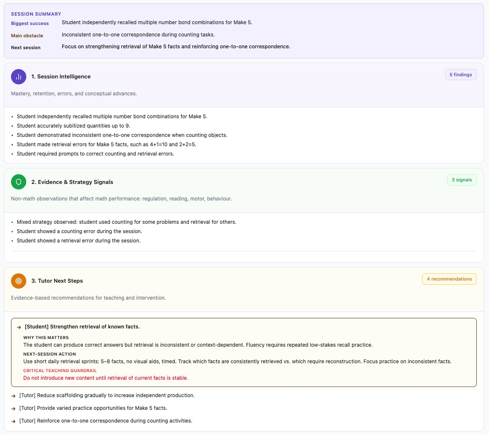

# AH — Numeracy Learning Intelligence

**Google × Kaggle AI Agents Capstone Project (2026)**

**Introducing a new category: _Numeracy Learning Intelligence_**

AH is an AI-powered Numeracy Learning Intelligence platform that transforms dyscalculia tutoring transcripts into structured, evidence-based learning intelligence, helping tutors understand what changed in every learning session.

**Demo video:** https://youtu.be/3ECpq8yxhhI

---

## The Problem

Tutors working with dyscalculic students write a note or transcript after every lesson. That record captures what happened — but almost never what changed: whether a skill moved from counting to retrieval, whether an error was a one-off slip or a real gap, what to do differently next time. That synthesis normally depends on the tutor's memory and judgment, session after session, with no structured trail for parents or for tracking progress over time.

AH replaces that manual synthesis step with a pipeline of five specialised AI skills that reads a session transcript and produces a structured report a tutor can act on immediately, and a parent can actually understand.

## What is AH?

Unlike general-purpose AI summarisation, AH separates educational reasoning into specialised analyses before synthesising evidence across them. AH decomposes a tutoring transcript into five specialised AI skills, each responsible for one pedagogical dimension. A synthesis layer combines their outputs into a structured learning intelligence report.

## Designed For

- Tutors delivering intervention-quality numeracy support
- Specialist educators supporting children with dyscalculia
- Parents reviewing structured learning progress

## How AH Works

```
Tutoring Transcript
        │
        ▼
Gemini 2.5 Flash — Five Specialised AI Skills
        │
        ▼
Synthesis Layer
        │
        ▼
Structured Learning Intelligence
        │
        ▼
Tutor Report + Parent Summary
```

## The Five Specialised AI Skills

Each skill performs one specialised pedagogical task using observable learning evidence only — no inferred causes, no diagnosis, no assumptions about attention, memory, or family circumstances.

| Skill                         | Purpose                                                   |
| ----------------------------- | --------------------------------------------------------- |
| Count Strategy Assessment     | Identifies the strategy used to solve counting tasks      |
| Retrieval Strength Assessment | Evaluates how reliably known facts can be recalled        |
| Number Bonds Assessment       | Assesses understanding of part-whole number relationships |
| Error Pattern Assessment      | Detects recurring numeracy error patterns                 |
| Intervention Recommendation   | Recommends the most appropriate instructional next step   |

Recommendations require recurring evidence across skills rather than an isolated error — this prevents over-recommending off a single event.

**Synthesis Layer:** consolidates the five outputs into `biggest_success`, `biggest_obstacle`, `progression_ready`, and `next_session_focus` — the fields driving the tutor and parent report views.

## Example Output

The synthesis layer combines evidence from all five AI skills into a structured output that can be stored, queried, and rendered consistently across tutor and parent views.

Representative synthesis output, illustrating the schema used in the `session_analysis` table:

```json
{
  "biggest_success": "Retrieved number bonds to 5 without counting.",
  "biggest_obstacle": "Relied on count-all for 7 + 5.",
  "progression_ready": false,
  "next_session_focus": [
    "Bridge from counting to retrieval using Make 10."
  ]
}
```

Every field maps directly to a structured output used by the tutor and parent dashboards. The synthesis layer combines evidence from all five AI skills into this structured output.

**Rendered in the tutor dashboard:**



## Architecture

```
Transcript
      │
      ▼
Gemini 2.5 Flash
      │
      ▼
Five Specialised AI Skills
      │
      ▼
Synthesis Layer
      │
      ▼
Supabase
  session_analysis
  mastery_updates
  recall_checks
      │
      ▼
React Dashboard
  Tutor View · Parent View
```

## Educational Design Principles

- **Evidence before inference** — every claim in a report traces back to an observed transcript moment
- **Observable learning behaviours only** — no diagnostic conclusions, no inferred causes
- **Tutor judgement remains central** — AH surfaces evidence and options; it doesn't prescribe
- **Recommendations require corroborating evidence across skills** — a single mistake never triggers a recommendation on its own

## Current MVP

This is a single-tutor, single-student pilot, not a multi-tenant product yet. It demonstrates the full pipeline end-to-end: transcript in, structured report out, for one real dyscalculia tutoring relationship.

**Current Capability:**
- Session logging and transcript capture
- Five specialised AI skills (Gemini 2.5 Flash)
- Synthesis Layer report generation
- Tutor dashboard with Why / Action / Guardrail recommendation cards
- Parent-facing view: session history, mastery status, and retention checks per skill

**Future Capability:**
- Multi-session trend analysis (mastery progression, retention curves across sessions)
- Multi-tutor / multi-student admin management
- Dynamic skill selection based on transcript evidence
- Cross-session mastery and retention integration
- Automated human-review workflow

## Technology Stack

| Layer                | Technology                                      |
| -------------------- | ----------------------------------------------- |
| Frontend             | React, TanStack Router, Tailwind CSS, shadcn/ui |
| Runtime              | Bun, Vite                                       |
| Backend              | Supabase (Postgres)                             |
| AI                   | Gemini 2.5 Flash                                |
| Development Platform | Lovable                                         |

There is currently no live production deployment — the app is run locally against the pilot Supabase project. The demo video shows the full pipeline running against real session data.

## Running Locally

Requirements: Bun, a Supabase project.

```bash
git clone https://github.com/julialin2005-ops/ah-numeracy-learning-intelligence.git
cd ah-numeracy-learning-intelligence
bun install
bun run dev
```

App runs at `localhost:8080`. Supabase connection details are configured in `src/lib/supabase-config.ts` and point to the live pilot database — no additional setup is required to view existing results.

To see a completed analysis: go to **Sessions**, then open the session dated **26/06/2026 (S6)** under Session History. This loads a full AI-generated report — Session Intelligence, Evidence & Strategy Signals, and Tutor Next Steps — from a real, already-analysed tutoring session.

Running a *new* analysis requires a Gemini API key (`VITE_GEMINI_API_KEY` in `.env`), which is intentionally not included in this repository.

## Repository Structure

```
src/
  routes/        # Pages — tutor, parent, admin, sessions, progress
  components/    # SessionReview, AppShell, shared UI primitives
  lib/           # Gemini integration, recommendation guidance, Supabase config
supabase/
  migrations/    # Schema + RLS migrations
docs/            # Synthesis layer design, learning taxonomy
```

## Vision

Today, AH analyses individual tutoring sessions. The next stage is longitudinal learning intelligence — synthesising evidence across many sessions to help tutors understand mastery progression, retention, intervention effectiveness, and long-term learning outcomes.

AH introduces Numeracy Learning Intelligence — a new approach to making learning progress visible through structured educational reasoning.
